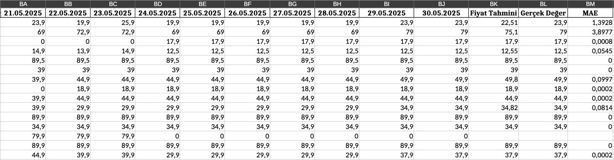
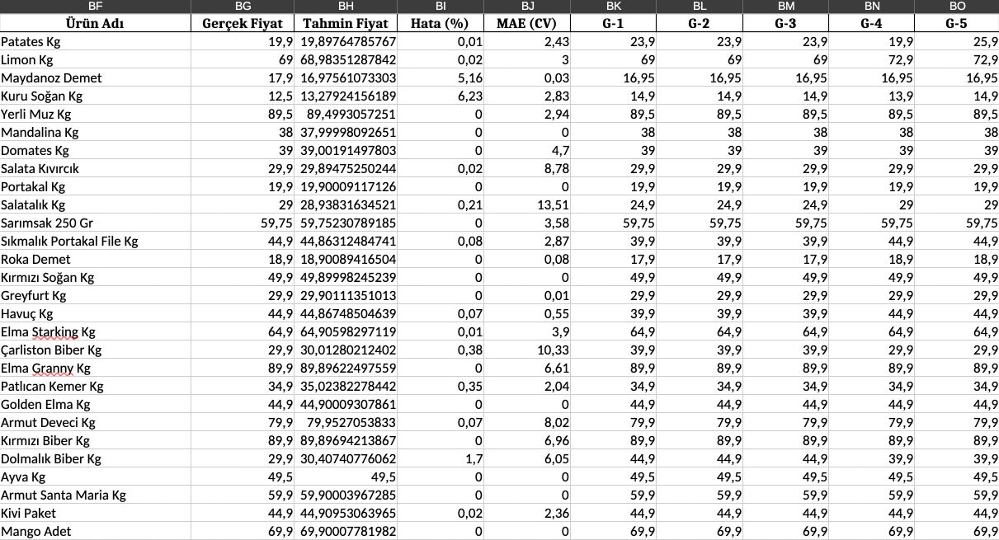
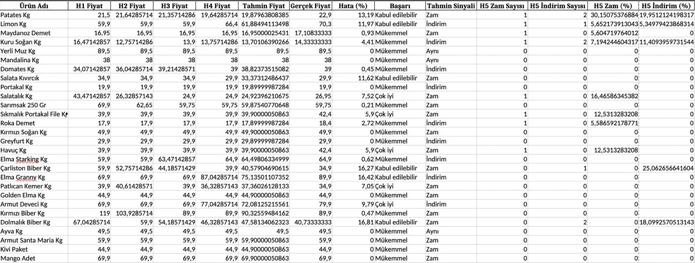

# 🛒 Deal-Eye: Market Fiyat Takip ve Tahmin Sistemi

## 🎓 Bitirme Projesi – 2025

**Deal-Eye**, marketfiyati üzerinden fiyat verisi toplayarak, geçmişe dayalı analiz ve geleceğe yönelik tahmin yapan, verileri MongoDB’de saklayan ve kullanıcıya modern bir arayüzle sunan **tam entegre bir piyasa izleme ve öngörü platformudur**.

---

## 📦 Proje Bileşenleri

### 1. 🕸 Veri Toplama – Selenium ile Web Scraping

- Kullanıcı lokasyonuna en yakın market seçilir.
- Sebze-meyve kategorisindeki ürünler filtrelenir.
- Ürün adı, fiyat ve görsel verileri alınır.
- Tüm sayfalarda gezinilerek tam liste elde edilir.
- Sonuçlar `products.json` ve `products.xlsx` olarak kaydedilir.
- Fiyat verisi olmayan ürünler için o günkü fiyat `0.0` olarak atanır.

---

### 2. 📊 Fiyat Tahmin Modülleri

#### 🔮 Günlük Tahmin (Model A)

- **Amaç**: Bir sonraki günün fiyatını tahmin etmek  
- **Girdi**: Son 14 günlük fiyat verisi  
- **Modeller**: XGBoost, Linear Regression, Polynomial Regression  
- **Yöntem**: MAE (mean absolute error) ile model başarımı hesaplanır, ağırlıklı ortalama ile tahmin yapılır

**Örnek Grafik**  


---

#### 📈 Zaman Serisi ile Günlük Tahmin (Model B)

- **Amaç**: Geçmiş 5 günü baz alarak bugün fiyat tahmini yapmak  
- **Yöntem**: Sliding Window + TimeSeriesSplit  
- **Model**: XGBoost  
- **Metrikler**: MAE, MAPE  

**Örnek Grafik**  


---

#### 📅 Haftalık Zam/İndirim Tahmini (Model C)

- **Amaç**: Önümüzdeki hafta zam veya indirim ihtimalini öngörmek  
- **Girdi Özellikleri**:
  - Haftalık ortalama fiyat
  - Zam/indirim sayısı ve yüzdesi
- **Modeller**:
  - Tahmini Fiyat: VotingRegressor (XGBoost + Random Forest + Ridge)
  - Zam Olasılığı: XGBClassifier
- **Çıktılar**: Zam ihtimali, tahmini zam oranı, sinyal ve başarı skoru

**Örnek Zam Tahmin Grafiği**  


---

## 🗃️ Veritabanı – MongoDB

Tüm ürünler ve fiyat geçmişi aşağıdaki yapıyla MongoDB'de saklanır:

```json
{
  "urunId": 101,
  "market": "Migros",
  "urun": "Domates",
  "img": "https://...",
  "prices": {
    "27-05-2025": 22.5,
    "28-05-2025": 22.9,
    "29-05-2025": 0.0
  }
}
```

Veriler, `Node.js` ve `Mongoose` ile MongoDB'ye yazılır ve güncellenir.

---

## 💻 Arayüz ve Teknolojiler

### 🖥️ Kullanıcı Arayüzü – React.js (Vite)

Deal-Eye'in arayüzü modern ve kullanıcı dostu olacak şekilde React (Vite) framework’üyle geliştirilmiştir. Arayüz aşağıdaki özellikleri içerir:

- ⚡ **Hızlı ve reaktif yapı**: Vite ile optimize edilmiş geliştirme deneyimi
- 🎨 **Tasarım**: Tailwind CSS ile sade ve modern arayüz, Heroicons simge desteği
- 📊 **Grafikler**: Fiyat geçmişi ve tahmin grafikleri için Chart.js kullanımı
- 📱 **Responsive tasarım**: Tüm cihazlarda uyumlu ve mobil erişime uygun
- 🔍 **Sayfalar**:
  - **Ana Sayfa**: Tüm ürünleri listeler, arama ve kategori filtreleme
  - **Market Sayfası**: Seçilen markete ait ürünler görüntülenir
  - **Ürün Detay Sayfası**: Fiyat geçmişi grafikleri ve tahmin kutusu yer alır
- 🌐 **Veri bağlantısı**: API istekleri `fetch` ile backend üzerinden alınır

---

### 🔧 Kullanılan Teknolojiler

| Amaç                     | Teknoloji                      |
|--------------------------|-------------------------------|
| Frontend Framework       | React (Vite)                  |
| Stil & UI                | Tailwind CSS                  |
| Simge Seti               | Heroicons                     |
| Grafikler                | Chart.js                      |
| Backend API              | Node.js + Express             |
| Veritabanı               | MongoDB + Mongoose            |
| Web Scraping             | Python + Selenium             |
| Tahmin Modelleri         | XGBoost, Random Forest, Ridge |
| Zaman Serisi Analizi     | TimeSeriesSplit (sklearn)     |
| Model Değerlendirme      | MAE, MAPE, Cross Validation   |
| Veri Dönüşümü & Temizleme| Pandas, NumPy                 |
| Dosya Formatları         | JSON, Excel (openpyxl)        |

---

## 📁 Klasör Yapısı (Özet)

```
Deal-Eye/
│
├── backend/
│   ├── routes/
│   ├── controllers/
│   ├── models/
│   ├── market-fiyat-org/
│   └── server.js
│
├── client/
│   ├── src/
│   │   ├── components/
│   │   ├── pages/
│   │   ├── utils/
│   │   └── App.jsx
│   └── index.html
│
└── README.md
```

---

## 🚀 Kurulum

```bash
git clone https://github.com/kullanici/deal-eye.git
cd deal-eye
npm install

# Terminal 1 - Backend başlat
cd backend
npm install
npm run dev

# Terminal 2 - Frontend başlat
cd client
npm install
npm run dev
```

---

## 👤 Geliştirici

**Berkay Yılmaz**  
Bitirme Projesi – Süleyman Demirel Üniversitesi  
Yıl: 2025
